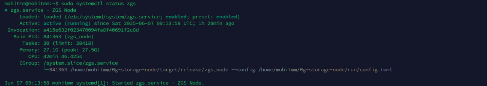
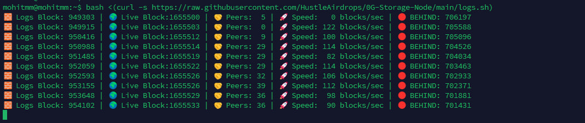

# 🚀 0G Lab Storage Node: Super Easy One-Command Guide

---

## 🖥️ Minimum System Requirements

- 🧠 **Memory:** 32 GB RAM  
- 🖥️ **CPU:** 8 cores  
- 💾 **Disk:** 500 GB / 1 TB NVMe SSD *(adjust if needed)*  
- 🌐 **Bandwidth:** 100 Mbps (Download/Upload)  

---

## ⚡ Pre-Setup Steps

1. 🔗 **Add 0G-Galileo-Testnet Chain:**  
    👉 [Testnet Info](https://docs.0g.ai/run-a-node/testnet-information)

2. 💧 **Get Testnet Tokens:**  
    👉 [0G Faucet](https://faucet.0g.ai/)

---

## 🛠️ Installation (Just 1 Command!)

Copy & run this in your terminal:

```bash
bash <(curl -s https://raw.githubusercontent.com/HustleAirdrops/0G-Storage-Node/main/installation.sh)
```

- 🔑 *When asked, paste your **private key** and hit Enter.*

---

## ▶️ Start Your Node

```bash
sudo systemctl start zgs
```

---

## 📋 Check Node Status & Logs

- 🔍 **Check if Node is Running:**
  ```bash
  sudo systemctl status zgs
  ```
- 📜 **See Live Logs:**
  ```bash
  tail -f ~/0g-storage-node/run/log/zgs.log.$(TZ=UTC date +%Y-%m-%d)
  ```


---

## ⛓️ Check Block & Sync Progress

```bash
bash <(curl -s https://raw.githubusercontent.com/HustleAirdrops/0G-Storage-Node/main/logs.sh)
```


---

## 🛑 Stop & Remove Node

```bash
sudo systemctl stop zgs
sudo systemctl disable zgs
sudo rm /etc/systemd/system/zgs.service
rm -rf $HOME/0g-storage-node
```

---

## 🔄 Change RPC Endpoint

1. 🌐 **Get new RPC:** [astrostake.xyz/0g-status](https://www.astrostake.xyz/0g-status)
2. 📝 **Run:**
     ```bash
     bash <(curl -s https://raw.githubusercontent.com/HustleAirdrops/0G-Storage-Node/main/rpc_change.sh)
     ```
3. ✍️ **Paste new RPC when asked.**

---

## 🔑 Change Private Key

```bash
bash <(curl -s https://raw.githubusercontent.com/HustleAirdrops/0G-Storage-Node/main/key_change.sh)
```
- *Paste your new private key when asked.*

---

## 🌍 Useful Links

- 🔎 **Explorer (Check Transactions):**  
  [chainscan-galileo.bangcode.id](https://chainscan-galileo.bangcode.id/)  
  [chainscan-galileo.0g.ai](https://chainscan-galileo.0g.ai/)

- ⛏️ **View Miner Details:**  
  [storagescan-galileo.0g.ai/miner/](https://storagescan-galileo.0g.ai/miner/)  
  *(Add your wallet address at the end)*

---

## 🙋 Need Help?

- 💬 **Contact:** [@Legend_Aashish](https://t.me/Legend_Aashish)
- 📺 **Guides & Updates:** [@Hustle_Airdrops](https://t.me/Hustle_Airdrops)

---

✨ *Stay ahead — join the channel now!*
